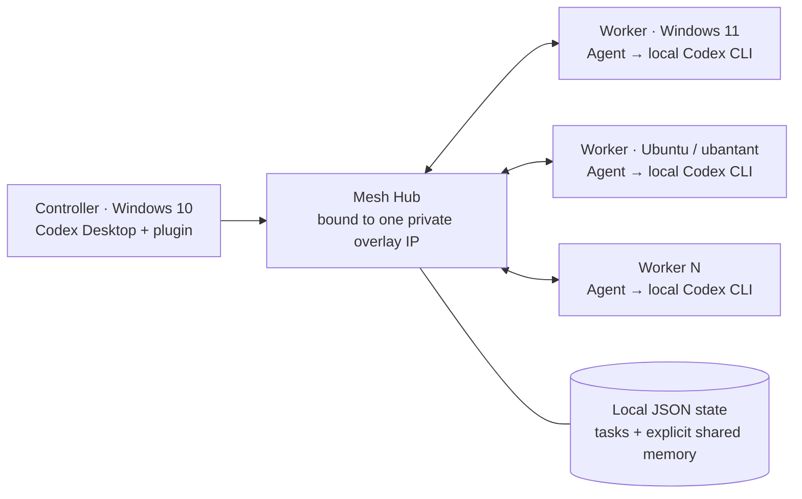

# Codex Mesh

[简体中文](README.zh-CN.md) | English

Codex Mesh is an Apache-2.0, self-hosted Codex plugin for delegating scoped work from one controller to any number of computers you own. The computers can be on different physical networks: a private overlay such as Tailscale or ZeroTier supplies connectivity, while each worker runs its own locally authenticated Codex CLI.

This is a personal-lab and development MVP. It is not a remote shell, a production orchestrator, or a secret-handling system.

## Architecture



Workers make outbound polling requests to the Hub. Codex itself is never exposed as an internet service, and Codex Mesh has no arbitrary-shell MCP tool. A task names a logical `workspace_id`; each worker maps that ID to its own local path.

For example, the same `project/example` ID can map to `D:\Projects\example` on Windows 11 and `/srv/projects/example` on Ubuntu.

## What it provides

- Dynamic enrollment for one or many Windows and Ubuntu workers. The core Agent is designed to be portable, but the v0.1 validation matrix covers Windows and Ubuntu only.
- Explicit-node or tag-based routing with `single`, `parallel`, and `first_available` execution.
- Required workspace scoping for every task, including read-only tasks.
- A local stdio MCP server and a direct `meshctl` command-line interface.
- Task progress, cancellation, per-node revocation, and controller-token rotation.
- Optional Hub-owned project memory that is shared only when explicitly added.
- No runtime npm dependencies.

Codex Mesh shared memory is separate from Codex's native memory. It does **not** synchronize `~/.codex/memories` between machines.

## Security warning

> A workspace mapping constrains the task's working directory and maximum write scope. It is **not a read-confidentiality boundary**. Depending on the operating system sandbox, Codex may still read other files available to the Agent's OS account and return their contents to the Hub.

Run every worker under a dedicated, low-privilege OS account or in a dedicated VM/container. That identity needs its own Codex authentication, but it should not have unrelated SSH keys, cloud credentials, browser profiles, production data, Docker access, extra MCP tools, or administrator privileges. It must not be able to read the Hub data directory or `controller.json`. If Hub and Agent share one physical computer, isolate them with separate OS accounts and filesystem permissions, or put the worker in a VM/container. Do not use this MVP for production or secrets.

For every remote run, the Agent ignores user configuration and explicitly disables hosted apps/connectors, hooks, remote plugins, multi-agent delegation, goals, memories, automatic skill dependency installation, web search, and command network access.

The controller token is a high-authority credential: it can fully control Mesh tasks and shared memory across every registered workspace. Hub state stores prompts, results, events, and shared memory as plaintext JSON. Memory `sensitivity` is only a label—not encryption or an ACL—and an expired memory stops appearing in search but is not physically erased from the JSON store. Never put secrets in prompts or memory.

Delivery does not provide exactly-once semantics. If an Agent is interrupted before acknowledging task start, an assignment may be delivered again. If a worker becomes unreachable after starting, the task may reach its TTL and become `expired` without automatic retry. Prompts with external side effects must still be idempotent. Review changes before committing, pushing, deploying, or publishing anything.

Read [SECURITY.md](SECURITY.md), [the detailed security model](docs/security-model.md), and [PRIVACY.md](PRIVACY.md) before enabling workspace writes.

## Cost

Codex Mesh itself is free and open source under Apache-2.0. At the time of writing, Tailscale offers a free Personal plan that is normally sufficient for a personal setup like this; pricing and plan terms can change, so check the [current Tailscale pricing page](https://tailscale.com/pricing). Codex subscriptions or API usage are separate and remain your responsibility on each worker.

No public server, domain, router port-forward, or Tailscale Funnel is required.

## Requirements

Install these on the relevant machines:

- Node.js 20 or newer on the controller and every worker.
- Tailscale or ZeroTier on all machines, joined to one private overlay network.
- Git for cloning the repository.
- An installed and authenticated Codex CLI on each worker, under the same low-privilege account that runs the Agent.
- Ubuntu: `bubblewrap` for reliable native Codex sandboxing (`sudo apt install bubblewrap` on supported Ubuntu releases).

See either the [Tailscale guide](docs/tailscale-setup.md) or the [ZeroTier guide](docs/zerotier-setup.md) before starting the Hub.

## Quick start: Windows 10 controller

Open PowerShell as the normal user that runs Codex. Do not use an administrator shell.

```powershell
git clone https://github.com/hty666-blip/codex-mesh.git
Set-Location .\codex-mesh\plugins\codex-mesh

$PrivateIp = "10.147.20.10" # Replace with the controller's Tailscale or ZeroTier IPv4
$HubUrl = "http://${PrivateIp}:7337"
$DataDir = Join-Path $env:LOCALAPPDATA "CodexMesh\data"

node .\src\hub\main.mjs init --data-dir $DataDir --hub-url $HubUrl
node .\src\hub\main.mjs serve --data-dir $DataDir --host $PrivateIp --port 7337
```

`init` creates the Hub state and `~/.codex-mesh/controller.json`. Both contain security-sensitive data; never commit or share them. Leave this PowerShell window open—the Hub stops when the process or Windows 10 machine stops.

Close every Codex Desktop window. In a second controller terminal, install the controller integration. This path does not install or invoke the Codex CLI:

```powershell
& .\scripts\install-controller-desktop.ps1
```

The installer backs up an existing `~/.codex/config.toml`, copies the MCP runtime to `%LOCALAPPDATA%\CodexMesh\controller`, registers it, and copies the Mesh skill. Restart Codex Desktop afterward. The MCP server reads the controller configuration created above; you can then ask Codex to list Mesh nodes, create a pairing, delegate a task to a selected node, follow or cancel it, and use explicitly stored project memory. Only worker machines require the Codex CLI.

If you prefer the standard marketplace workflow and already have the Codex CLI, you can instead run `codex plugin marketplace add hty666-blip/codex-mesh` followed by `codex plugin add codex-mesh@hty666-blip`.

## Add the Windows 11 worker

First create a unique, one-time pairing code in the second controller terminal:

```powershell
node .\src\cli\main.mjs pair --name worker-win11
```

Copy only the returned `pairingCode` to the Windows 11 machine. Then, on Windows 11, use the dedicated worker account:

```powershell
git clone https://github.com/hty666-blip/codex-mesh.git
Set-Location .\codex-mesh\plugins\codex-mesh
& .\scripts\install-agent.ps1

$Agent = Join-Path $env:LOCALAPPDATA "CodexMesh\bin\mesh-agent.cmd"
$HubUrl = "http://10.147.20.10:7337"  # Replace with the controller's private overlay IPv4

& $Agent enroll `
  --hub $HubUrl `
  --pairing-code "PASTE_ONE_TIME_CODE" `
  --name "worker-win11" `
  --tags "worker,windows" `
  --workspace "project/example=D:\Projects\example" `
  --workspace-mode workspace-write

& $Agent run
```

Keep the foreground Agent running for the initial test. Enrollment creates `%APPDATA%\codex-mesh\agent.json`, which contains that node's bearer token. Do not copy it to another machine. The installer makes no firewall, service, Scheduled Task, or administrator-level change; an optional least-privilege Task Scheduler template is in `scripts/windows/`.

Use `--workspace-mode read-only` if that worker should never accept write tasks. Repeat `--workspace "ID=PATH"` to register more workspaces.

## Add the Ubuntu worker (`ubantant`)

Create a **new** pairing code on the Windows 10 controller; pairing codes are single-use:

```powershell
node .\src\cli\main.mjs pair --name ubantant
```

Then run the following as the dedicated, non-root Ubuntu worker account:

```sh
sudo apt update
sudo apt install bubblewrap

git clone https://github.com/hty666-blip/codex-mesh.git
cd codex-mesh/plugins/codex-mesh
sh ./scripts/install-agent.sh

AGENT="$HOME/.local/share/codex-mesh/bin/mesh-agent"
HUB_URL="http://10.147.20.10:7337" # Replace with the controller's private overlay IPv4

"$AGENT" enroll \
  --hub "$HUB_URL" \
  --pairing-code "PASTE_DIFFERENT_ONE_TIME_CODE" \
  --name "ubantant" \
  --tags "worker,linux,server" \
  --workspace "project/example=/srv/projects/example" \
  --workspace-mode workspace-write

"$AGENT" run
```

The default Agent config is `~/.config/codex-mesh/agent.json`. Test in the foreground first. An optional hardened user-systemd template is in `scripts/linux/`; it is not installed or enabled automatically.

## Add more computers

Repeat the same two steps for every new worker:

1. Run `meshctl pair --name UNIQUE_NAME` on the controller.
2. Enroll exactly one Agent with that fresh code and its own workspace mappings.

Use unique node configurations and tokens, and run only one Agent process per config. Never clone an already enrolled Agent config. Give related workers a common tag such as `worker` or `review` so a controller can select several of them.

## Control and verify the fleet

Run these from `plugins/codex-mesh` on the Windows 10 controller:

```powershell
# List nodes and copy their IDs
node .\src\cli\main.mjs nodes

# Read-only work on one exact node; workspace is still mandatory
node .\src\cli\main.mjs submit `
  --workspace "project/example" `
  --mode read-only `
  --node "NODE_ID" `
  --execution single `
  --prompt "Inspect the tests and report failures. Do not edit files."

# Fan out to every online worker carrying the common `worker` tag
node .\src\cli\main.mjs submit `
  --workspace "project/example" `
  --mode read-only `
  --tag worker `
  --online `
  --execution parallel `
  --prompt "Review this repository and report the three highest-risk issues."

# List tasks, inspect one task, or request cancellation
node .\src\cli\main.mjs task
node .\src\cli\main.mjs task "TASK_ID"
node .\src\cli\main.mjs cancel "TASK_ID" --reason "No longer needed"
```

For workspace-write work, normally select one node and use isolated Git branches/worktrees when work could overlap.

Shared memory is explicit:

```powershell
node .\src\cli\main.mjs memory add `
  --scope "project/example" `
  --key "architecture/runtime" `
  --content "The runtime baseline is Node.js 20."

node .\src\cli\main.mjs memory search "runtime" --scope "project/example"
```

Do not store credentials or confidential material in memory.

Memory uses upsert semantics: adding the same `scope` and `key` replaces the previous content. Search and confirm an existing entry before overwriting it.

## Kill switch and revocation

For an online task, cancel it first and then stop the Agent locally. Cancellation is best effort; revoking a lost or unreachable node cannot guarantee termination of a Codex child process that is already running on that machine.

```powershell
node .\src\cli\main.mjs cancel "TASK_ID" --reason "Emergency stop"
node .\src\cli\main.mjs node revoke "NODE_ID" --reason "Device lost or retired"
```

Also remove a lost device from the Tailscale admin console. Stopping the Hub immediately cuts off all new Mesh coordination. If the controller credential may be exposed, stop the Hub, rotate it, and restart:

```powershell
# Stop the running Hub with Ctrl+C first
$TailIp = (& tailscale ip -4 | Select-Object -First 1).Trim()
$DataDir = Join-Path $env:LOCALAPPDATA "CodexMesh\data"
node .\src\hub\main.mjs rotate-controller-token --data-dir $DataDir
node .\src\hub\main.mjs serve --data-dir $DataDir --host $TailIp --port 7337
```

## Troubleshooting

- **Cannot reach the Hub:** run `tailscale ping <controller-device-name>`, then request `http://CONTROLLER_TAILSCALE_IP:7337/v1/health` with `curl.exe` or `curl`. Confirm the Hub is running and bound to the exact Tailscale IP.
- **Windows Firewall prompt:** allow the Node process only for the private/Tailscale path and TCP port `7337`. Do not create a router port-forward or public firewall rule.
- **Node is offline:** keep `mesh-agent run` active, confirm that the local Codex CLI is authenticated under the Agent account, and verify every configured workspace still exists.
- **Config already exists:** do not use `--force` until you know which token/config you are replacing. A normal restart uses `run`, not `enroll`.
- **Agent says the config is already in use:** another Agent is running with that config. Stop it; do not run duplicate workers with the same node token.
- **Codex can read too much:** stop the Agent and reduce the OS account's filesystem permissions or move it into a dedicated VM/container. A narrower workspace alone does not fix read confidentiality.
- **Controller sleeps or shuts down:** the Hub becomes unavailable. For always-on use, host the Hub on an always-on private machine and migrate deliberately; do not expose it publicly.

See [docs/tailscale-setup.md](docs/tailscale-setup.md) for a longer network checklist.

## Development and tests

```sh
cd plugins/codex-mesh
npm test
node ./src/hub/main.mjs --help
node ./src/agent/main.mjs --help
node ./src/cli/main.mjs --help
```

See [CONTRIBUTING.md](CONTRIBUTING.md). The standard Codex plugin lives in [`plugins/codex-mesh`](plugins/codex-mesh); repository-level marketplace metadata lives under `.agents/plugins/`.

## License

Apache License 2.0. See [LICENSE](LICENSE).
