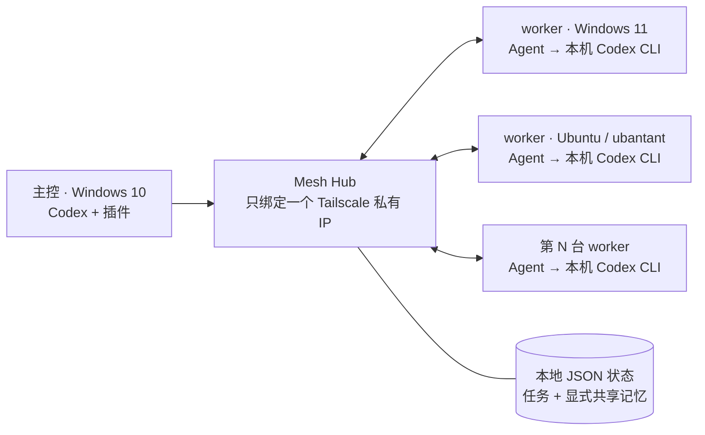

# Codex Mesh

简体中文 | [English](README.md)

Codex Mesh 是一个采用 Apache-2.0 协议的开源、自托管 Codex 插件。它让一台主控电脑把有明确工作区范围的任务交给任意多台你自己管理的电脑执行；这些电脑不需要在同一局域网，通过 Tailscale 私有网络即可互通。

你的三台机器可以这样分工：

- Windows 10：运行 Codex、Codex Mesh 插件和 Mesh Hub，作为主控。
- Windows 11：运行 Mesh Agent 和本机已登录的 Codex CLI，作为桌面 worker。
- Ubuntu 服务器 `ubantant`：运行 Mesh Agent 和本机已登录的 Codex CLI，作为长期在线 worker。

后面还可以用相同流程继续增加第 4、5、N 台电脑。每台 worker 都有自己的身份、标签、工作区映射和撤销令牌。

> 当前版本是面向个人开发环境的 MVP，不是远程桌面、任意远程 Shell、生产调度平台或秘密管理系统。

## 先回答两个关键问题

**私有网络怎么弄？** 三台机器都安装 Tailscale，并登录到同一个 tailnet。Tailscale 会给每台机器分配一个私有 IP；不需要三台机器处于同一 Wi-Fi，不需要公网 IP、域名、路由器端口转发，也不要开启 Tailscale Funnel。

**要钱吗？** Codex Mesh 自身免费开源。本文编写时，Tailscale 提供适合个人使用的免费 Personal 方案，通常足够这类三机或多机配置；价格与方案条款以后可能变化，请以 [Tailscale 当前价格页](https://tailscale.com/pricing) 为准。每台 worker 使用 Codex 产生的订阅或 API 成本另计。

## 架构



Agent 主动轮询 Hub，所以 worker 不需要开放入站服务。Hub 只监听 Windows 10 的明确 Tailscale IP；程序会拒绝公网地址和 `0.0.0.0`、`::` 等通配监听。Codex 本身不会作为网络服务暴露出去，插件也不提供任意远程 Shell 工具。

每个任务都必须指定逻辑 `workspace_id`，只读任务也不例外。同一个逻辑 ID 可以映射到不同机器上的不同路径：

| 机器 | 逻辑 ID | 本地路径 |
|---|---|---|
| Windows 11 | `project/example` | `D:\Projects\example` |
| Ubuntu | `project/example` | `/srv/projects/example` |

主控只需要说“在 `project/example` 上执行”；具体本地路径由各 worker 自己的配置决定，路径不会在配对时发给 Hub。

## 能做什么

- 动态加入或撤销任意数量的 Windows 与 Ubuntu worker。核心 Agent 按可移植方式设计，但 v0.1 的验证矩阵目前只覆盖 Windows 和 Ubuntu。
- 按节点 ID、操作系统或标签选择机器。
- `single`：选一台；`parallel`：多台并行；`first_available`：匹配机器中先有空闲资源的机器执行。
- 选择 `read-only` 或 `workspace-write`，但不能远程请求 `danger-full-access`。
- 在主控 Codex 中通过 MCP 列出节点、创建配对、下发任务、查看进度、取消任务和使用共享记忆。
- 也可绕过对话界面，直接用 `meshctl` CLI 操作。
- 每个节点有独立令牌；支持单节点撤销和主控令牌轮换。
- 运行时没有 npm 第三方依赖。

## 共享记忆是什么

共享记忆是 Codex Mesh Hub 自己保存的、需要显式写入的项目笔记。它适合保存“项目使用 Node.js 20”“某项架构决策已经确认”这类低敏感度信息。

它**不会**同步各台机器上的 `~/.codex/memories`，也不会自动复制三台 Codex 的全部历史。这样设计是为了让共享内容可控，而不是把每台机器的私人上下文全部混在一起。

还有三个重要限制：

1. `sensitivity` 只是标签，不会加密内容，也不是访问控制规则。
2. `expiresAt` 到期后只是不再被搜索返回，当前版本不会从 Hub JSON 中物理擦除记录。
3. Hub 以明文 JSON 保存提示词、任务输出、事件和共享记忆。

因此，任何密码、令牌、SSH 私钥、客户数据或其他秘密都不应该写入提示词或共享记忆。

## 必须理解的安全边界

> `workspace_id` 限制任务从哪里开始，以及任务允许写入到什么范围；它**不是读取保密边界**。根据操作系统与 Codex sandbox 的实现，worker 上的 Codex 仍可能读取该 OS 账号有权读取的其他文件，并把内容返回给 Hub。

所以每台 worker 应使用专用的低权限 OS 账号，或者放进专用 VM/容器。该身份需要单独完成 Codex 登录，但不要让它访问无关的：

- SSH 私钥和 ssh-agent；
- 云平台、数据库和生产环境凭据；
- 浏览器用户目录和登录 Cookie；
- Docker socket；
- 生产数据、私人文档或其他项目秘密；
- 不受控的全局 MCP 服务或其他高权限工具；
- 管理员/root 权限。

主控令牌是高权限凭据：拥有它的人可以完全控制所有已登记工作区的 Mesh 任务与共享记忆。`controller.json`、Hub 数据目录和每台机器的 `agent.json` 都不要提交到 GitHub，也不要通过聊天转发。worker Agent 的 OS 账号绝不能读取 Hub 数据目录或 `controller.json`；如果同一台物理机同时运行 Hub 和 Agent，必须使用隔离的 OS 账号与文件权限，或者把 worker 放进 VM/容器。

每次远程运行时，Agent 都会忽略用户配置，并显式关闭托管应用/连接器、Hooks、远程插件、多代理委派、Goals、Memories、Skill 依赖自动安装、网页搜索及命令网络访问。

任务投递不保证 exactly-once。Agent 在确认任务开始前中断时，分配可能再次投递；worker 在任务启动后失联时，任务可能一直到 TTL 后变成 `expired`，且不会自动重试。因此，带外部副作用的提示词仍要具备幂等性；提交、推送、部署、发消息、发布等动作必须由人检查后完成。

在开放写权限前，请先阅读 [SECURITY.md](SECURITY.md)、[完整安全模型](docs/security-model.md) 和 [PRIVACY.md](PRIVACY.md)。当前版本不要用于生产环境、管理员任务或秘密处理。

## 第 0 步：准备三台机器

所有机器：

- 安装 Node.js 20 或更高版本；
- 安装 Git；
- 安装 Tailscale，并登录同一个 tailnet；
- 确认 Tailscale 中能看到另外两台设备。

两台 worker 还需要：

- 用实际运行 Agent 的专用低权限账号安装并登录 Codex CLI；
- 在这个账号下运行 `codex --version`，确认命令可用；
- 预先创建要登记的本地工作区目录。

Ubuntu 建议安装 `bubblewrap`，以便 Codex 原生 sandbox 可靠工作：

```sh
sudo apt update
sudo apt install bubblewrap
```

Tailscale 的完整检查步骤见 [docs/tailscale-setup.md](docs/tailscale-setup.md)。

## 第 1 步：在 Windows 10 初始化主控 Hub

用运行 Codex 的普通用户打开 PowerShell，不要用管理员终端：

```powershell
git clone https://github.com/hty666-blip/codex-mesh.git
Set-Location .\codex-mesh\plugins\codex-mesh

$TailIp = (& tailscale ip -4 | Select-Object -First 1).Trim()
if (-not $TailIp) { throw "没有找到 Tailscale IPv4 地址" }
$HubUrl = "http://${TailIp}:7337"
$DataDir = Join-Path $env:LOCALAPPDATA "CodexMesh\data"

node .\src\hub\main.mjs init --data-dir $DataDir --hub-url $HubUrl
node .\src\hub\main.mjs serve --data-dir $DataDir --host $TailIp --port 7337
```

`init` 只需要在第一次运行。它会创建：

- Hub 状态：`%LOCALAPPDATA%\CodexMesh\data\hub.json`；
- 主控配置：`~/.codex-mesh/controller.json`。

初始化输出里也会出现主控令牌，不要截图或分享。第二条 `serve` 命令会持续占用当前窗口；保持窗口和 Windows 10 开机，否则 Hub 会离线。

## 第 2 步：在 Windows 10 安装 Codex 插件

另开一个普通 PowerShell 窗口：

```powershell
codex plugin marketplace add hty666-blip/codex-mesh
codex plugin add codex-mesh@hty666-blip
```

插件里的 MCP server 会读取上一步生成的 `~/.codex-mesh/controller.json`。安装后，你可以在主控 Codex 里用自然语言操作，例如：

- “列出所有 Codex Mesh 节点和在线状态。”
- “为一台名为 worker-win11 的新机器生成配对码。”
- “在 worker-win11 的 project/example 上做只读测试分析。”
- “在所有带 review 标签的在线节点上并行审查项目。”
- “把已确认的 Node.js 版本决定写入 project/example 的共享记忆。”

对话中的具体工具调用仍然受 Hub 的工作区、模式和节点权限检查。

## 第 3 步：加入 Windows 11 worker

先在 Windows 10 的第二个 PowerShell 窗口、仓库的 `plugins/codex-mesh` 目录中生成一次性配对码：

```powershell
node .\src\cli\main.mjs pair --name worker-win11
```

输出 JSON 中有 `pairingCode`。只把这个一次性码复制到 Windows 11；不要复制 `controller.json`。

然后用 Windows 11 的专用 worker 账号运行：

```powershell
git clone https://github.com/hty666-blip/codex-mesh.git
Set-Location .\codex-mesh\plugins\codex-mesh
& .\scripts\install-agent.ps1

$Agent = Join-Path $env:LOCALAPPDATA "CodexMesh\bin\mesh-agent.cmd"
$HubUrl = "http://100.x.y.z:7337"  # 换成 Windows 10 的 Tailscale IPv4

& $Agent enroll `
  --hub $HubUrl `
  --pairing-code "粘贴一次性配对码" `
  --name "worker-win11" `
  --tags "worker,windows" `
  --workspace "project/example=D:\Projects\example" `
  --workspace-mode workspace-write

& $Agent run
```

首次测试先保持前台运行。Windows Agent 配置默认位于 `%APPDATA%\codex-mesh\agent.json`，里面有该节点的独立 bearer token，不能复制给其他节点。

安装脚本只把无依赖的 Agent/CLI 文件复制到 `%LOCALAPPDATA%\CodexMesh`，不会提权，不会修改防火墙，也不会自动创建服务或计划任务。测试成功后，如需登录后自动启动，可自行审阅并填写 `scripts/windows/codex-mesh-agent-task.xml.template`，再以当前低权限用户导入任务计划程序。

如果这台机器永远只允许分析，不允许修改，把最后一个选项改为：

```powershell
--workspace-mode read-only
```

可以重复 `--workspace "ID=路径"` 登记多个工作区，例如：

```powershell
--workspace "project/api=D:\Projects\api" `
--workspace "project/web=D:\Projects\web"
```

## 第 4 步：加入 Ubuntu worker（`ubantant`）

Windows 11 的配对码已经使用，不能重复。先回到 Windows 10，为 Ubuntu 生成一个新码：

```powershell
node .\src\cli\main.mjs pair --name ubantant
```

在 Ubuntu 上用专用非 root 账号运行：

```sh
git clone https://github.com/hty666-blip/codex-mesh.git
cd codex-mesh/plugins/codex-mesh
sh ./scripts/install-agent.sh

AGENT="$HOME/.local/share/codex-mesh/bin/mesh-agent"
HUB_URL="http://100.x.y.z:7337" # 换成 Windows 10 的 Tailscale IPv4

"$AGENT" enroll \
  --hub "$HUB_URL" \
  --pairing-code "粘贴另一个一次性配对码" \
  --name "ubantant" \
  --tags "worker,linux,server" \
  --workspace "project/example=/srv/projects/example" \
  --workspace-mode workspace-write

"$AGENT" run
```

Ubuntu Agent 配置默认在 `~/.config/codex-mesh/agent.json`。安装目标默认是 `~/.local/share/codex-mesh`。先以前台方式验证；`scripts/linux/codex-mesh-agent.service.template` 是可选的用户级 systemd 模板，项目不会自动安装、启用或提权。

## 第 5 步：检查节点并执行第一个任务

回到 Windows 10 的 `plugins/codex-mesh` 目录：

```powershell
node .\src\cli\main.mjs nodes
```

记录输出中的节点 ID。先做一个风险较低的只读任务：

```powershell
node .\src\cli\main.mjs submit `
  --workspace "project/example" `
  --mode read-only `
  --node "NODE_ID" `
  --execution single `
  --prompt "检查测试配置并报告问题，不要修改任何文件。"
```

查看任务：

```powershell
node .\src\cli\main.mjs task
node .\src\cli\main.mjs task "TASK_ID"
```

给 Windows 11 和 Ubuntu 都设置了共同的 `worker` 标签后，可以并行下发：

```powershell
node .\src\cli\main.mjs submit `
  --workspace "project/example" `
  --mode read-only `
  --tag worker `
  --online `
  --execution parallel `
  --prompt "独立审查这个项目，列出最重要的三个风险，不要修改文件。"
```

标签条件是筛选条件；给多台机器增加同一个用途标签（例如 `review`）最容易进行多选。涉及写入时，通常只选一台节点；如果多台机器都要改同一项目，应使用互相隔离的 Git 分支或 worktree，再人工合并。

## 第 6 步：显式使用共享记忆

保存一条非秘密的项目决定：

```powershell
node .\src\cli\main.mjs memory add `
  --scope "project/example" `
  --key "architecture/runtime" `
  --content "项目运行时基线为 Node.js 20。"
```

搜索：

```powershell
node .\src\cli\main.mjs memory search "运行时" --scope "project/example"
```

共享记忆是辅助上下文，不是真相数据库。重要内容仍应放在版本控制的项目文档中，并由人审阅。

同一个 `scope + key` 使用 upsert 语义，再次添加会覆盖原内容。覆盖前应先搜索并确认现有条目。

## 增加更多电脑

每增加一台 worker，只重复两个动作：

1. 在主控运行 `meshctl pair --name 唯一名称`，生成全新一次性码。
2. 在新机器运行一次 `mesh-agent enroll`，设置自己的标签和 `workspace_id=本地路径`。

不要复制已经注册过的 `agent.json`，也不要用同一配置同时运行两个 Agent。每台节点都有独立令牌，这样设备丢失时才能只撤销那一台。

## Kill switch、取消和设备丢失

在线任务应先请求取消，然后在 worker 本地停止 Agent：

```powershell
node .\src\cli\main.mjs cancel "TASK_ID" --reason "紧急停止"
```

取消是尽力而为。设备已经离线时，主控撤销令牌不能保证杀死那台机器上已经启动的 Codex 子进程；必须在机器本地停止进程，或禁用/关停该 OS 账号或 VM。

撤销一台节点：

```powershell
node .\src\cli\main.mjs node revoke "NODE_ID" --reason "设备丢失或退役"
```

设备丢失时，还要在 Tailscale 管理控制台移除该设备。停止 Windows 10 上的 Hub 会立即停止新的 Mesh 协调。如果主控令牌可能泄露，先按 `Ctrl+C` 停掉 Hub，再轮换令牌：

```powershell
$TailIp = (& tailscale ip -4 | Select-Object -First 1).Trim()
$DataDir = Join-Path $env:LOCALAPPDATA "CodexMesh\data"
node .\src\hub\main.mjs rotate-controller-token --data-dir $DataDir
node .\src\hub\main.mjs serve --data-dir $DataDir --host $TailIp --port 7337
```

每个数据目录只能运行一个 Hub 进程。

## 故障排查

### worker 无法连接 Hub

在 worker 上先检查 Tailscale：

```text
tailscale status
tailscale ping <Windows-10-设备名>
```

再检查 Hub 健康接口：

```powershell
curl.exe http://WINDOWS10_TAILSCALE_IP:7337/v1/health
```

```sh
curl http://WINDOWS10_TAILSCALE_IP:7337/v1/health
```

确认 Windows 10 的 Hub 进程还在运行，并且 `--host` 是 `tailscale ip -4` 返回的明确私有 IP。不要改成 `0.0.0.0`，不要做路由器端口转发，不要开启 Funnel。

### Windows 防火墙拦截

首次运行 Node 时 Windows 可能询问网络访问。只允许 Node 在私有/Tailscale 网络上接收 TCP `7337`；如果手动创建规则，应把程序、端口和远端 Tailscale 地址范围收窄。不要建立公网规则。

### 节点一直离线

- 确认 `mesh-agent run` 仍在运行；
- 确认 Agent 使用的低权限账号能执行 `codex --version`，并且已完成 Codex 登录；
- 确认配置中的本地工作区还存在，该账号有需要的权限；
- 检查系统时间是否明显错误；
- 不要让两个 Agent 共用同一个配置，进程锁会拒绝这种情况。

### 提示配置已存在

正常重启只需执行 `run`，不要再次 `enroll`。除非你明确要替换节点身份，否则不要随便加 `--force`；替换后旧节点还需要在主控撤销。

### Codex 能读取不该读取的文件

立即停止 Agent，收紧该 OS 账号的文件权限，或把 Agent 移到专用 VM/容器。仅把 `workspace_id` 指向更小目录不能解决读取保密问题。

### Windows 10 休眠或关机

Hub 会不可用，worker 会等待而不是自动暴露到公网。如果需要 7×24 小时运行，可以以后把 Hub 有计划地迁移到一直在线的私有机器；迁移配置和数据时不要直接公开端口。

## 开发与测试

插件位于标准目录 `plugins/codex-mesh`。从仓库根目录执行：

```sh
npm --prefix plugins/codex-mesh test
node plugins/codex-mesh/src/hub/main.mjs --help
node plugins/codex-mesh/src/agent/main.mjs --help
node plugins/codex-mesh/src/cli/main.mjs --help
```

更多说明见 [CONTRIBUTING.md](CONTRIBUTING.md)。

## 许可证

Apache License 2.0，见 [LICENSE](LICENSE)。
